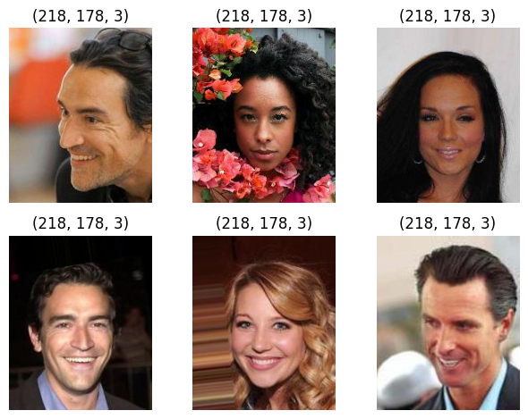
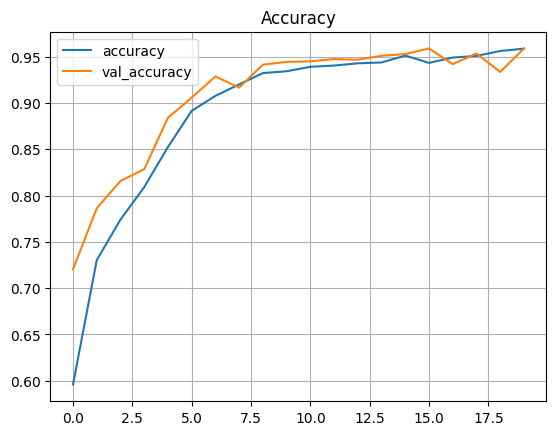
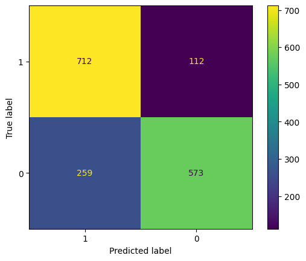

# Project 1 Face Recognition

## Latar Belakang
Manusia sering kali melakukan kesalahan dalam memposisikan diri, dimana seharusnya dia boleh masuk pada tempat tertentu atau pun tidak boleh. Seperti halnya pada tempat sholat, gerbong komuter khusus perempuan, toilet, tempat konser dan lain sebagainya yang mana telah dibedakan menjadi laki-laki dan perempuan. Oleh sebab itu perlu adanya sistem untuk mengklasifikasikan jenis kelamin menggunakan fitur wajah yang memiliki tingkat akurasi yang baik.

## Informasi Umum
Dalam Repository ini saya mencoba implementasikan GoogleNet([paper](https://arxiv.org/abs/1409.4842v1)|[code](https://github.com/pytorch/vision/blob/6db1569c89094cf23f3bc41f79275c45e9fcb3f3/torchvision/models/googlenet.py#L62)) untuk klasifikasi jenis kelamin (gender) menggunakan datasets [CelebA](https://drive.google.com/drive/folders/1Pv4ItGpDrLQG833nZioU_7PUqrRGjIeY?usp=sharing).
Contoh sampel gambarnya:

## Strategi Kriteria Uji
Saya menggunakan beberapa kriteria untuk uji coba yakni:
1. Menguji scope Learning rate yakni 0.001, 0.01 dan 0.1
2. Menguji scope Batch size yakni 16, 32 dan 64 dengan menggunakan hasil learning rate terbaik yakni 0.001
3. Menguji scope  Split data yakni 80:20, 70:30 dan 60:40 menggunakan hasil learning rate terbaik yakni 0.001 dan batch size terbaik yakni 16

## Hasil Uji Best Accuracy
Grafik Loss Evaluation
[[loss-evaluation.png]]

Grafik Accuracy

Confusion Matrix

## Table Model
| Test Case | Learning rate | Epoch | Split data | Batch size | Accuracy |
| --- | --- | --- | --- | --- | --- |
| Learning rate 0.001 | 0.001 | 5 | 80:20 | 32 | 0.9016 |
| Learning rate 0.01 | 0.01 | 5 | 80:20 | 32 | 0.4873 |
| Learning rate 0.1 | 0.1 | 5 | 80:20 | 32 | 0.5127 |
| Batch_size 16 | 0.001 | 5 | 80:20 | 16 | 0.8539 |
| Batch_size 32 | 0.001 | 5 | 80:20 | 32 | 0.8225 |
| Batch_size 64 | 0.001 | 5 | 80:20 | 64 | 0.8478 |
| Split Data 80:20 | 0.001 | 20 | 80:20 | 16 | **0.9589** |
| Split Data 70:30 | 0.001 | 20 | 70:30 | 16 | 0.9452  (stop in 19 epoch) |
| Split Data 60:40 | 0.001 | 20 | 60:40 | 16 | 0.9493 |

## Kesimpulan
- Learning rate : Semakin kecil learning rate, loss functionya semakin kecil, namun untuk proses waktu training semakin lama
- Batch_size : Semakin besar, semakin cepat proses training, namun loss function semakin besar
- epoch : Semakin banyak semakin bisa untuk belajar atau training, namun ketika tidak ada perubahan pada akurasi tiap epoch nya, maka besar epoch tidak terlalu berimbas pada model
- split training test 80:20; 70:30; dan 60:40; : Tidak memberikan pengaruh yang signifikan pada akurasi model
- Best parameter : parameter terbaik yang mendapatkan akurasi paling tinggi adalah learning rate 0.001, split data 80:20, batch size: 16 dan epoch 20 mendapatkan akurasi paling tinggi sebesar **0.9589**.
